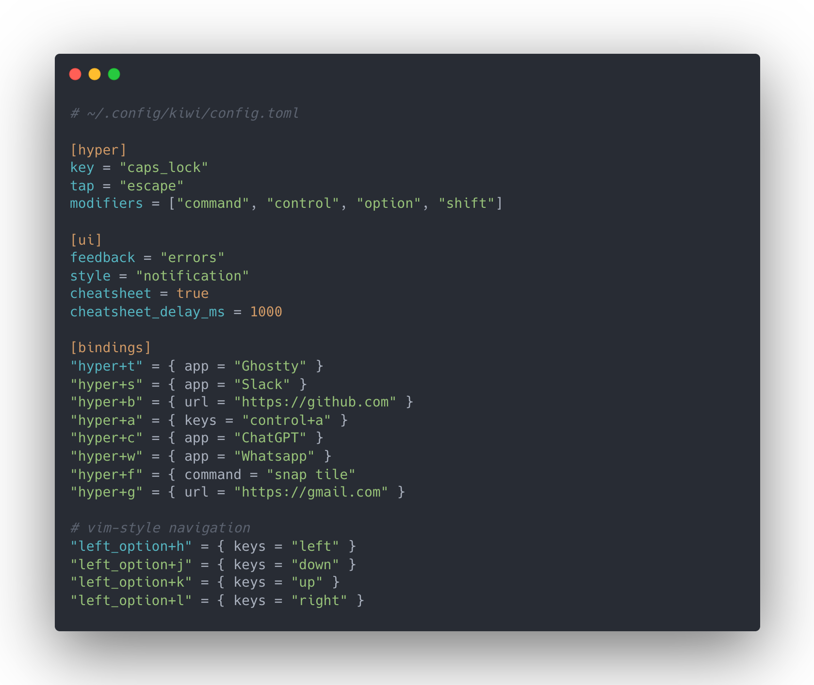

<div align="center">
  <h1>snap 🫰</h1>
  <p><strong>Fast, stateless window management for macOS.</strong></p>
</div>

<div align="center">
  <p>
    
    
    
    <a href="https://crates.io/crates/snap-macos"></a>
  </p>

  <!--<p>
    
  </p> -->

  <p>
    <a href="#install">Install</a>
    &nbsp;·&nbsp;
    <a href="#usage">Usage</a>
    &nbsp;·&nbsp;
    <a href="#configuration">Configuration</a>
    &nbsp;·&nbsp;
    <a href="#keyboard-shortcuts">Keyboard shortcuts</a>
  </p>
</div>

---

snap is a fast, minimal command-line window manager for macOS. It gives you
the useful parts of graphical window managers like Rectangle — without a
menu-bar app, a background daemon, or a config file you have to write before
it's usable.

Every command does one thing, then exits:

```
command → manipulate windows → exit
```

It doesn't manage Spaces, replace Mission Control, or keep a persistent
layout tree. It just puts your windows where you want them.

## Install

```bash
brew install cesarferreira/tap/snap   # installs the `snap` binary, no Rust toolchain needed
```

Homebrew installs the binary as `snap` (not `snap-macos` — that's just the
crates.io name, since `snap` was taken there too); kiwi will still need the
**absolute path**, `$(brew --prefix)/bin/snap`.

Alternatively, install from crates.io — requires [Rust](https://rustup.rs)
**1.85+** and `~/.cargo/bin` on your `PATH`:

```bash
cargo install snap-macos   # installs the `snap` binary
```

Verify:

```bash
snap --help
```

The first time snap needs to move a window, macOS will ask you to grant
**Accessibility** permission (System Settings → Privacy & Security →
Accessibility) — for the app that launched it (your terminal), since snap has
no bundle of its own for macOS to attribute the permission to directly. If
something still looks off, run [`snap doctor`](#diagnostics) — it's the one
command besides `snap list` that prints on success.

<details>
<summary><strong>Build from source</strong> — for development or unreleased changes</summary>

```bash
git clone https://github.com/cesarferreira/snap.git
cd snap
cargo install --path . --locked
# or
make install-release
```

Debug install (faster compile, larger binary):

```bash
make install
```

Run without installing:

```bash
make build-release
./target/release/snap
```

</details>

<a id="usage"></a>
## Usage

```
snap <size>
snap <position> [size]
snap <command>
```

### Sizing

Resize the focused window to a percentage of the current display's usable
area, keeping it centered. Any integer percent from 1 to 100 is valid:

```bash
snap 25
snap 40
snap 50
snap 67
snap 100   # same as `snap full`
```

Omit the percentage to **cycle** 50% → 75% → 25% → 50% → ... each time you
run it, like Rectangle:

```bash
snap
```

Cycling is stateless — snap looks at the window's *current* size to figure
out which step to apply next, so it works correctly no matter what ran it
last, and there's nothing to remember between invocations.

### Positioning

Anchor the focused window to a side, sized to any integer percent (1-100) of
the screen:

```bash
snap left 50
snap right 33
snap top 50
snap bottom 50
```

Omit the size to cycle 50/75/25%, per side. Cycling only steps through those
three values regardless of what arbitrary percent the window currently has —
if the window doesn't match one of the cycle steps, the first press snaps to
50%:

```bash
snap left    # 50% → 75% → 25% → 50% → ...
```

### Corners

Anchor the focused window to a corner, occupying that percent of usable
**width and height** (not a full-height/width strip):

```bash
snap top-left 50
snap top-right 50
snap bottom-left 50
snap bottom-right 50
```

Omit the size to cycle 50/75/25%, independently per corner (a `top-left 50%`
window is never mistaken for a `left 50%` strip). `snap top-left 100` fills
the usable area, same as `snap full`.

### Thirds

Full-height left/center/right thirds, handy on ultrawide displays:

```bash
snap third left
snap third center
snap third right
```

Omit the position to cycle left → center → right → left (`snap thirds` is an
alias). The three columns exactly cover the usable width with no gap or
overlap — the last column absorbs any remainder pixels.

### Commands

```bash
snap full     # fill the current display (not native macOS fullscreen)
snap center   # center the window, keep its current size
snap tile     # tile visible windows on the current display
```

`snap tile` lays windows out deterministically: 1 window fills the screen, 2
split 50/50, 3 use a master + stack layout, 4 form a 2×2 grid, and 5+ form a
balanced grid (`columns = ceil(sqrt(n))`). The focused window always gets the
first slot; the rest are ordered top-to-bottom, then left-to-right. Only the
current display is affected — other monitors are left alone.

```bash
snap tile --gap 24   # override the gap between tiles for this run
```

Named layout variants opt out of the default assignment:

```bash
snap tile columns   # n equal columns, full height, focused leftmost
snap tile rows      # n equal rows, full width, focused topmost
snap tile master    # focused ~50% width left; the rest stack evenly on the right
snap tile master --gap 24
```

Use `columns`/`rows`/`master` when you always want the same shape regardless
of window count (e.g. four terminals as even columns on an ultrawide).

### Grow, shrink, almost

```bash
snap grow      # increase toward the usable bounds
snap shrink    # decrease toward a minimum
snap almost    # fill usable area minus an extra inset (not fullscreen)
```

`grow`/`shrink` scale by 10% of the usable width/height per invocation, about
the window's center — unless an edge is already flush with a usable edge, in
which case that edge stays put (so `grow` after `snap left` widens to the
right, not both ways). `shrink` stops at 10% of usable width/height; `grow`
stops at the usable bounds. Both are stateless and repeatable.

`almost` is like `snap full` but inset further by `almost_padding` (see
[Configuration](#configuration)), so a sliver of desktop stays visible on
every edge. It never invokes native fullscreen.

### Undo

```bash
snap undo
```

Restores the focused window to its frame from before the last mutation that
touched it. A second `snap undo` toggles back — undo/redo as a swap, no
stack. This is the one place snap keeps on-disk state: a flat
`window_number → previous frame` cache at
`~/Library/Caches/snap/last-frames.json`, written after every successful
mutation (`left`/`right`/.../`tile`/`display`/...; never for failed
commands, and `list`/`doctor` don't count). Entries older than 24h are
pruned. If nothing is recorded for the focused window — including right
after `snap tile`, where undo restores only that one window, not the whole
tiled group — `error: nothing to undo`, exit 1. If the cache can't be
written, mutations still succeed; only undo may fail.

### Focus history

```bash
snap daemon install   # one-time: starts the focus-history background agent
snap last              # focus whatever was focused immediately before this
snap last              # run it again to toggle back
snap daemon uninstall  # stop and remove the agent
```

`snap last` is the one command in this tool backed by a background
process — everything else stays one-shot. `snap daemon install` writes and
loads a launchd user agent that watches for focus changes system-wide (not
just snap's own actions) and remembers the two most recent windows.
`snap last` toggles between them, the same way `snap undo` toggles a
window's geometry. The daemon holds a process-lifetime lock, so accidental
manual starts cannot create competing history writers. If you never run
`snap daemon install`, snap behaves
exactly as before — no daemon, nothing running in the background.

### Diagnostics

```bash
snap doctor
```

Prints everything needed to debug a broken setup: Accessibility trust,
binary path, the effective config (and whether `~/.config/snap.toml` was
found), Stage Manager status, every attached display with its usable
bounds and which one is "current," the focused window, and the persistent
error-log path (`~/Library/Logs/snap/errors.log`). CLI and focus-daemon
failures are appended there with timestamps for later inspection. Read-only —
never moves a window — and, unlike every other command, doesn't require
Accessibility to run: it reports trust status as one line among several and
exits 0 as long as it produced a report. Safe to paste into a GitHub issue.

### Targeting a window by app name

By default every command acts on the focused window. `--app NAME` targets a
different app instead, useful for scripts and non-interactive bindings:

```bash
snap --app Ghostty left 50
snap --app "Google Chrome" full
```

Matching is exact and case-insensitive against the app name (as
`CGWindowList`/Activity Monitor report it — `snap list` shows the same
names). If the app is frontmost, its currently focused window is used;
otherwise its largest window (ties broken by title). Unknown app → `error:
no window for app 'X'`, exit 1. Two distinct running processes sharing the
same displayed name → an ambiguous-match error, exit 1.

`--app` applies to size, sides, corners, `full`, `center`, and `display`.
It is **not** supported with `tile` (a display-wide operation) — `snap --app
Foo tile` errors; use `snap --app Foo full` instead.

### Listing windows

```bash
snap list                  # windows on the current display (default)
snap list --display all    # every attached display
```

`snap list` is the one command that prints on success — everything else is
silent by design. Same window filters and ordering as `snap tile` (focused
first, then top-to-bottom, left-to-right):

```
ID       APP                  DISPLAY FOCUSED TITLE
182      Ghostty              1       *       snap
194      Google Chrome        1               GitHub
201      Slack                2               #general
```

`ID` is the window's `kCGWindowNumber`, stable for the life of the window.
`TITLE` is best-effort — macOS withholds window titles without Screen
Recording permission. No window is moved.

### Spatial focus

Raise/activate the nearest window in a direction on the current display,
without moving or resizing anything — vim-style motion between panes:

```bash
snap focus left
snap focus right
snap focus up
snap focus down
```

Neighbor picking uses the window centers: nearest wins, ties break by larger
overlap on the perpendicular axis. No wrap to the other side of the screen
and no jumping to another display — an edge is a dead end. `error: no window
to the left` (etc.), exit 1, if nothing qualifies.

### Swap neighbor

Exchange frames with the nearest window in a direction — how you rotate
which window sits in the "master" slot after `snap tile`, without a
retile:

```bash
snap swap left
snap swap right
snap swap up
snap swap down
```

Same neighbor picker as `snap focus`. Focus stays on the originally focused
window — it just moved. No wrap-around, no crossing displays. If a window
can't be resized, the whole swap aborts and any already-applied half is
restored on a best-effort basis.

### Accordion stack

A stateless accordion, AeroSpace-style: one window fills the usable bounds,
the rest peek from the edges so you're reminded they exist:

```bash
snap stack           # apply; front = currently focused window
snap stack next      # raise the next window in the stack, re-apply peek layout
snap stack previous  # opposite direction (alias: prev)
```

Same candidate set as `snap tile` (current display only). Orientation is
picked automatically from the display shape: wide/square displays peek
left/right, tall ones peek top/bottom. `next`/`previous` detect the current
front from live window frames — no daemon, no persisted "we are in accordion
mode." If the windows don't currently look like a stack (you dragged one),
`next`/`previous` apply the stack first, then advance once, so the hotkey
always does something useful. A single window is equivalent to `snap full`;
`stack next`/`previous` with only one window errors (`error: only one
window`, exit 1) so a hotkey mash is noticeable. Run `snap tile` afterward
to leave accordion mode.

### Multi-monitor

Move the focused window to another display, keeping its relative position
and size (e.g. left-50% on display A becomes left-50% on display B):

```bash
snap display next       # cycle to the next display, wrapping around
snap display previous
snap display 1          # 1-based index among currently attached displays
```

Displays are ordered left-to-right, then top-to-bottom (ties broken by
`NSScreen` order) — the same order `snap display N` indexes into. Spaces,
native fullscreen, and other windows/displays are left untouched. With only
one display attached, `next`/`previous` fail with `error: only one display`
(exit 1) instead of silently doing nothing.

### Output & exit codes

Successful commands print nothing, so snap is safe to bind to hotkeys and use
in scripts, except the two read-only commands: `snap list` prints its table
and `snap doctor` prints its report. Errors go to stderr.

| Code | Meaning                          |
| ---- | -------------------------------- |
| 0    | Success                          |
| 1    | Runtime failure (e.g. no focused window) |
| 2    | Invalid arguments                |
| 3    | Accessibility permission unavailable |

<a id="configuration"></a>
## Configuration

snap works with zero configuration. If you want to tweak the defaults,
create `~/.config/snap.toml`:

```toml
# Screen-edge and inter-tile padding, in points. Applied to every command
# (left/right/top/bottom/full/center inset from the screen edge; tile uses
# it as both the outer margin and the gap between tiles). Default: 16.
padding = 16

# Width, in points, reserved on the left edge of every display when Stage
# Manager is on, so windows never cover its strip. Ignored entirely when
# Stage Manager is off. Set to 0 to disable the reservation. Default: 150.
stage_manager_width = 150

# Extra inset, in points, `snap almost` applies beyond `padding` so a sliver
# of desktop stays visible on every edge. Default: 48.
almost_padding = 48

# Peek strip width/height, in points, `snap stack` gives background windows.
# Set to 0 to disable the peek (front-only; `next`/`previous` still raise).
# Default: 30.
accordion_padding = 30
```

Stage Manager doesn't expose its strip width through any public API, so
`150` is a good starting estimate — adjust it to match what you actually see
on your display.

<a id="keyboard-shortcuts"></a>
## Keyboard shortcuts

snap doesn't register global hotkeys itself. The supported pairing is
**[kiwi](https://github.com/cesarferreira/kiwi)** — a small native daemon that
maps chords to commands from one TOML file. No Karabiner, no Raycast, no
menu-bar app.

```toml
# ~/.config/kiwi/config.toml
[hyper]
key = "caps_lock"
tap = "escape"
modifiers = ["command", "control", "option", "shift"]

[bindings]
"hyper+f" = { command = "~/.cargo/bin/snap tile" }
"left_option+command+left" = { command = "~/.cargo/bin/snap left" }
"left_option+command+right" = { command = "~/.cargo/bin/snap right" }
"left_option+command+up" = { command = "~/.cargo/bin/snap top" }
"left_option+command+down" = { command = "~/.cargo/bin/snap bottom" }
"hyper+n" = { command = "~/.cargo/bin/snap display next" }
"hyper+7" = { command = "~/.cargo/bin/snap top-left" }
"hyper+8" = { command = "~/.cargo/bin/snap top-right" }
"hyper+9" = { command = "~/.cargo/bin/snap bottom-left" }
"hyper+0" = { command = "~/.cargo/bin/snap bottom-right" }
"hyper+3" = { command = "~/.cargo/bin/snap third" }
"hyper+equal" = { command = "~/.cargo/bin/snap grow" }
"hyper+minus" = { command = "~/.cargo/bin/snap shrink" }
"hyper+return" = { command = "~/.cargo/bin/snap almost" }
"hyper+h" = { command = "~/.cargo/bin/snap focus left" }
"hyper+l" = { command = "~/.cargo/bin/snap focus right" }
"hyper+k" = { command = "~/.cargo/bin/snap focus up" }
"hyper+j" = { command = "~/.cargo/bin/snap focus down" }
"hyper+shift+left" = { command = "~/.cargo/bin/snap swap left" }
"hyper+shift+right" = { command = "~/.cargo/bin/snap swap right" }
"hyper+shift+up" = { command = "~/.cargo/bin/snap swap up" }
"hyper+shift+down" = { command = "~/.cargo/bin/snap swap down" }
"hyper+s" = { command = "~/.cargo/bin/snap stack" }
"hyper+shift+n" = { command = "~/.cargo/bin/snap stack next" }
"hyper+shift+p" = { command = "~/.cargo/bin/snap stack previous" }
"hyper+g" = { command = "~/.cargo/bin/snap --app Ghostty full" }
"hyper+z" = { command = "~/.cargo/bin/snap undo" }
```

Sides omit the size so they cycle 50% → 75% → 25%. Use the absolute path:
kiwi's LaunchAgent has a minimal `PATH`, so a bare `snap` will not resolve.
After saving, kiwi reloads the config on its own.

If you already have a launcher, bind the same `snap` commands there instead
([Raycast](https://raycast.com), [Karabiner-Elements](https://karabiner-elements.pqrs.org),
[skhd](https://github.com/koekeishiya/skhd), [BetterTouchTool](https://folivora.ai),
macOS Shortcuts).


## License

MIT
